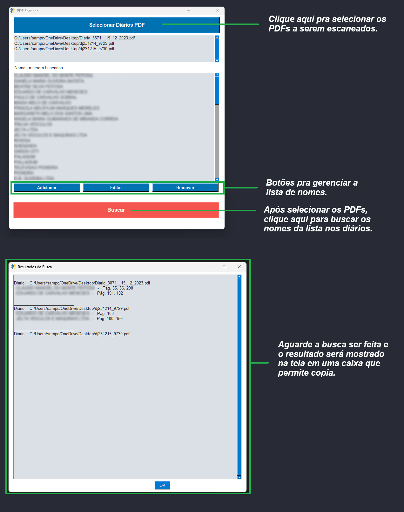

# Busca Diario

Programa que busca uma lista de nomes das Partes Processuais nos PDFs do Diário Oficial.

## Demo

Execute o arquivo:

`BuscaDiario.exe`

## Alterações

O código-fonte pode ser encontrado em . 
1. Abra estre arquivo com sua IDE de escolha e ao finalizar suas alterações;
2. Rode o seguinte comando para buildar um novo executável:

`pyinstaller --onefile --noconsole BuscaDiario.py`

## Guia de Utilização

